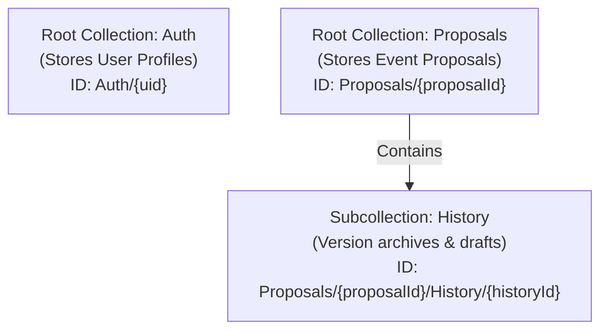

# 📋 Google Cloud Firestore Database & Indexing Technical Guide
## 🚀 Technical Interview Preparation — Event Proposal App

Welcome! This guide is systematically designed to prepare you for your technical interview tomorrow. It covers everything from the database architecture, schema validations, query designs, prefix matching, and **how indexing works under the hood in Cloud Firestore**.

---

## 🔍 Table of Contents
1. [Core Database Architecture](#1-core-database-architecture)
2. [Detailed Data Models & Zod Validation Gateway](#2-detailed-data-models--zod-validation-gateway)
3. [Deep Dive: How Indexing Works in Google Cloud Firestore](#3-deep-dive-how-indexing-works-in-google-cloud-firestore)
4. [Advanced Query Mechanics in the Codebase](#4-advanced-query-mechanics-in-the-codebase)
5. [NoSQL Architectural Design Choices & Tradeoffs](#5-nosql-architectural-design-choices--tradeoffs)
6. [🎓 High-Impact Interview Q&A (Cheat Sheet)](#-high-impact-interview-qa-cheat-sheet)

---

## 1. Core Database Architecture

The application utilizes **Google Cloud Firestore** as its primary database. Firestore is a cloud-hosted, serverless, NoSQL document-oriented database that scales horizontally.

### Key Architectural Characteristics
* **Document-Oriented:** Data is stored in **Documents**, which contain key-value pairs (similar to JSON objects). Documents are organized into **Collections**.
* **Subcollections for Hierarchy:** To model 1-to-many relationships (like version history of a proposal), Firestore allows nesting collections inside documents, forming **Subcollections**.
* **Real-time Sync & Serverless:** Built-in listener support allowing clients to sync state instantly (although this application primarily interacts via standard asynchronous HTTP API routes).
* **Distributed and High Availability:** Built on Google's global infra, meaning data replication and scaling are managed entirely by GCP.

### Collection & Hierarchy Map
Our database layout is structured as follows:



* **`/Auth` (Root Collection):** Tracks system users, their departments, roles (`Admin`, `Reviewer`, `Proposer`), and reviewer levels.
* **`/Proposals` (Root Collection):** Tracks active event proposals, their current state, the reviewer they are currently assigned to, and their overall approval/rejection status.
* **`/Proposals/{proposalId}/History` (Subcollection):** Stores past drafts, comments, and replies archived from previous proposal versions (before updates or status changes).

---

## 2. Detailed Data Models & Zod Validation Gateway

Because NoSQL databases are inherently **schema-less** at the database level, it is critical to enforce data integrity at the **application level**. 

This application uses **Zod schemas** in `/schemas` to act as an API gateway validator before any document is written or updated.

### 👤 User Schema (`/schemas/user.schema.js`)
Enforces boundaries on user data before registration or updating.
* **Base Validation Rules:**
  * `email`: Must be a valid email format ending with `@cb.students.amrita.edu` (enforced via Regex).
  * `role`: Must be one of `Admin`, `Reviewer`, or `Proposer`.
  * `level`: Must be a positive integer, **required only if** the user's role is `Reviewer` (enforced using a custom Zod `.refine()` block).

> [!NOTE]  
> **Refine Logic:** The conditional requirement where `level` is mandatory only when `role === 'Reviewer'` is implemented using Zod's `superRefine` or `refine`:
> ```javascript
> .refine(data => {
>     if (data.role === "Reviewer") return typeof data.level === "number";
>     return data.level === undefined;
> }, { message: "Only reviewers must have a numeric level", path: ["level"] })
> ```

### 📝 Proposal Schema (`/schemas/proposal.schema.js`)
Validates the dense multi-tab event proposal form data.
* **Key Fields & Rules:**
  * `title`: String, minimum 5 characters.
  * `description`: String, minimum 20 characters.
  * `registrationFee`: Number, cannot be negative.
  * `isIndividual`: Boolean. If `false`, Zod's `superRefine` demands that `groupDetails` must be provided (checks group fee type and maximum member bounds).
  * `isResourcePersonPaid`: Boolean. If `true`, a secondary conditional check requires `resourcePersonPayment` to be filled.
  * `status`: Constrained to `"Pending"` during creation, and handles versions (`version`) starting at `1`.
  * `currentReviewer`: An object storing the current reviewer’s `reviewerId`, `name`, `email`, and `level`.

---

## 3. Deep Dive: How Indexing Works in Google Cloud Firestore

Firestore queries are designed to guarantee performance that scales with the size of the *result set*, not the size of the *entire dataset*. If a query returns 10 results, it will take the exact same time whether the collection has 100 documents or 10,000,000 documents.

To achieve this, **Firestore requires indexes for all queries**. If an index does not exist, the query will immediately fail.

### 1. Single-Field Indexes (Automatic)
Firestore automatically creates single-field indexes for:
1. Every standard field in a document.
2. Every sub-field inside nested maps/objects (e.g., `currentReviewer.reviewerId` is indexed automatically).
3. Every array field (creates an index of array elements to support `array-contains` queries).

* **How it works:** Firestore maintains two indexes for every field: one in ascending order and one in descending order.
* **Usage in App:** Simple queries like `where("role", "==", role)` or `where("currentReviewer.reviewerId", "==", reviewerId)` use automatic single-field indexes out-of-the-box.

### 2. Composite Indexes (Required for Multi-Field Queries)
A **Composite Index** indexes multiple fields in a specific order. It is required whenever your query:
* Filters by multiple fields with inequality operators (`<`, `>`, `<=`, `>=`).
* Filters by one field and orders (`orderBy`) by another.

#### Practical Example in our Code (`app/api/proposalService.js`):
```javascript
const q = query(
    collection(db, "Proposals"),
    where("proposerId", "==", userId),
    orderBy("updatedAt", "desc"),
);
```

#### Why it requires an index:
To execute this query efficiently, Firestore cannot scan all documents. It requires an index sorted by both `proposerId` and `updatedAt` so it can jump directly to the segment matching `proposerId === userId` and read the documents in the sorted order of `updatedAt` descending.

#### If the index is missing:
Firestore throws a `FAILED_PRECONDITION` error in your application logs. The error contains a direct URL. Clicking that link opens the Firebase Console, where the exact composite index is pre-configured and created automatically:
* **Collection ID:** `Proposals`
* **Fields:** `proposerId` (Ascending), `updatedAt` (Descending)

### 3. Collection Group Indexes
Normally, a query searches a single collection at a specific path (e.g., `/Proposals/propA/History`).
A **Collection Group query** searches across all collections that have the same name, regardless of where they are nested in the database (e.g., searching all collections named `"History"` under any proposal).

#### Practical Example in our Code (`app/api/reviewer/[id]/proposals/route.js`):
```javascript
const q2 = query(
    collectionGroup(db, "History"),
    where("proposalThread.currentReviewer.reviewerId", "==", reviewerId),
);
```

#### Why it requires an index:
This query searches across `/Proposals/prop1/History`, `/Proposals/prop2/History`, and so on. 
By default, Firestore does not index subcollections across document boundaries. To make this query work, you **MUST** create a **Collection Group Index** in your Firebase console:
* **Collection Group:** `History`
* **Field:** `proposalThread.currentReviewer.reviewerId` (Ascending)

---

## 4. Advanced Query Mechanisms in the Codebase

### 🔍 Prefix Range Matching for Search (The `\uf8ff` Unicode Trick!)
Firestore does **not** support fuzzy text search (e.g., `LIKE %name%` or regex search on indexed fields). However, our user service (`app/api/userService.js`) implements a high-performance **prefix-matching (starts-with)** search:

```javascript
const searchUsersByName = async (name) => {
    const q = query(
        collection(db, "Auth"),
        where("name", ">=", name),
        where("name", "<=", name + "\uf8ff"),
    );
    const querySnapshot = await getDocs(q);
    return querySnapshot.docs.map((doc) => ({ id: doc.id, ...doc.data() }));
};
```

#### How this works under the hood:
1. `name` is the lower bound (e.g., if searching `"Sud"`, it matches `"Sud"`, `"Sudhar"`, etc.).
2. `name + "\uf8ff"` is the upper bound. The character `\uf8ff` is a very high Unicode character (the last character in the private-use area).
3. Lexicographically, any string that starts with the prefix `"Sud"` will sort after `"Sud"` and before `"Sud\uf8ff"` (e.g., `"Sudharsan"` fits inside this range, whereas `"Sue"` sorts after `"Sud\uf8ff"`).
4. Because the field `name` is indexed, Firestore performs a rapid range-scan of the single-field index in $O(\log N)$ time, making prefix search lightning-fast!

### 📥 Array & Set Operators
* **`in` Operator:** Used in `app/api/reviewer/[id]/proposals/route.js` for Level 2 Reviewers:
  ```javascript
  const q = query(
      proposalsRef,
      where("department", "in", reviewerData.department)
  );
  ```
  The `in` operator evaluates whether the document's `department` matches any value in the `reviewerData.department` array (up to a limit of 30 values).
* **`arrayUnion` Operator:** Used in forwarding proposals (`/api/proposal/[id]/forward/route.js`):
  ```javascript
  await updateDoc(proposalRef, {
      reviewerHistory: arrayUnion(historyEntry),
      currentReviewer: { ...nextReviewer },
  });
  ```
  Instead of fetching the array, modifying it in Node, and writing it back (which presents concurrency risks), `arrayUnion` is an **atomic database-level operation** that adds an element to the array if it doesn't already exist, avoiding race conditions.

---

## 5. NoSQL Architectural Design Choices & Tradeoffs

NoSQL requires shifting from standard relational paradigms to document models. Here is how our app tackles these challenges:

### 🔄 Denormalization: Array vs. Subcollection
We track history in two distinct ways, illustrating a strategic tradeoff:

| Tracking Method | Implementation | Use Case | Tradeoff |
| :--- | :--- | :--- | :--- |
| **Embedded Array** | `reviewerHistory` field inside `Proposals` document (modified via `arrayUnion`). | Storing high-level reviewer approval logs (who signed off, level, date, brief comment). | **Pros:** Single document read to show the approval history pipeline.<br>**Cons:** Limited by Firestore's 1MB document size limit (if an event had 1,000 review steps, it could swell the document). |
| **Subcollection** | `/Proposals/{id}/History` collection (new documents added on version increments). | Archiving full draft text changes, extensive discussion threads, and comments before an update. | **Pros:** Prevents parent proposal documents from growing too large; clean separation of active data and archival history.<br>**Cons:** Requires extra query operations (slower/more reads) to retrieve history. |

### 🧠 In-Memory Filtering for Department Matching
In `app/api/reviewerService.js` under `getReviewerProposals`:
```javascript
const proposalsSnapshot = await getDocs(collection(db, "Proposals"));
const proposals = [];
proposalsSnapshot.forEach((doc) => {
    const proposalData = doc.data();
    if (proposalData.department && departments.includes(proposalData.department)) {
        proposals.push({ id: doc.id, ...proposalData });
    }
});
```

#### The Tradeoff Analysis:
* **Why it was done:** If `departments` array is dynamic or complex, client-side/in-memory filtering is trivial to write and avoids managing dynamic Firestore composite index limits (e.g., matching combinations of arrays in queries).
* **The Interview Catch:** You should mention that while this works perfectly for small-to-medium datasets, it **does not scale** long-term! Fetching *all* proposals and filtering them in-memory forces the server to read $N$ documents every time, leading to high database read bills and slower load times as the application grows.
* **How to optimize it in a real-world scenario:** Replace the full fetch with a direct parameterized Firestore query: `where("department", "in", departments)`.

---

## 🎓 High-Impact Interview Q&A (Cheat Sheet)

Be ready to answer these database-specific questions during your interview tomorrow:

### Q1: What database does this project use, and why?
> **Answer:** "The project uses Google Cloud Firestore. As a NoSQL document database, it is serverless, highly scalable, and fully managed, allowing us to rapidly iterate on data models like users and proposal documents. It allows schema-less writes at the DB level, which we secure and validate at the API layer using Zod schemas."

### Q2: How does Firestore handle indexing, and what is the difference between a single-field and a composite index?
> **Answer:** "Firestore automatically indexes every individual field in a document, including fields in nested maps and array elements, in both ascending and descending order. However, if we write a query that filters by one field and orders by another, or applies inequality filters on multiple fields, Firestore requires a pre-defined **Composite Index**. A composite index sorts documents on multiple fields simultaneously so Firestore can return query results in $O(\log N)$ search time. If a composite index is missing, Firestore returns a `FAILED_PRECONDITION` error with a link to create it."

### Q3: I noticed a Collection Group query in your reviewer route. What is that and why does it need a special index?
> **Answer:** "A normal query searches documents in a single collection. In our reviewer proposals endpoint, we perform a **Collection Group Query** across all collections named `'History'` nested within any parent proposal document. This allows us to search across the entire database to find past proposals where a specific reviewer was involved. Because this crosses parent document boundaries, Firestore requires a dedicated **Collection Group Index** on the field we are filtering by, which is `proposalThread.currentReviewer.reviewerId` in the `'History'` group."

### Q4: How did you implement text search in Firestore since it doesn't support wildcard or regex searches?
> **Answer:** "Firestore lacks native full-text search operators like `LIKE %query%`. To implement prefix matching, we used a range query. We query documents where the name is greater than or equal to the search prefix, and less than or equal to the search prefix plus the high Unicode character `\uf8ff`. Since the `name` field is indexed, this performs an efficient range scan of the index to find all names starting with that prefix in logarithmic time."

### Q5: How do you handle schema validation in a schema-less NoSQL database like Firestore?
> **Answer:** "We validate data at the application gateway level. In Next.js, we define **Zod schemas** (like `user.schema.js` and `proposal.schema.js`). Before any document is written or updated via our API endpoints, we run `.safeParse()` on the incoming request payload. This enforces field types, string boundaries, regular expressions for college emails, and complex conditional requirements—such as making sure a reviewer always has a numeric approval level, or requiring group details only when the event is not individual."

---

⚡ **Best of luck on your interview tomorrow! You've got this!**
